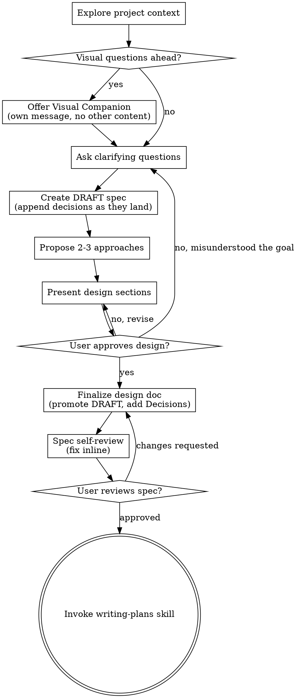

# Brainstorming Ideas Into Designs

Help turn ideas into fully formed designs and specs through natural collaborative dialogue.

Start by understanding the current project context, then ask questions one at a time to refine the idea. Once you understand what you're building, present the design and get user approval.

<HARD-GATE>
Do NOT write any code, scaffold any project, invoke any implementation skill, or take any implementation action until ALL of these are true: a design was presented and approved, the spec is written and committed, the user has reviewed the written spec, and the writing-plans skill has been invoked. Chat approval of a design ("looks good, go ahead") clears the NEXT checklist item only — it is not permission to implement. This applies to EVERY project regardless of perceived simplicity.
</HARD-GATE>

## Anti-Pattern: "This Is Too Simple To Need A Design"

Every project goes through this process. A todo list, a single-function utility, a config change — all of them. "Simple" projects are where unexamined assumptions cause the most wasted work. The design can be short (a few sentences for truly simple projects), but you MUST present it and get approval.

## When NOT to Use

- **Debugging / fixing a regression** — use superpowers-flutter:systematic-debugging. If the fix turns out to change intended behavior, come back here.
- **Executing an already-approved plan** — use superpowers-flutter:executing-plans or subagent-driven-development.
- **Pure research or questions** — no implementation ahead means nothing to design.

## Checklist

You MUST create a task for each of these items and complete them in order:

1. **Explore project context** — check files, docs, recent commits
2. **Offer visual companion** (if topic will involve visual questions) — this is its own message, not combined with a clarifying question. See the Visual Companion section below.
3. **Ask clarifying questions** — one at a time, understand purpose/constraints/success criteria
4. **Propose 2-3 approaches** — with trade-offs and your recommendation
5. **Present design** — in sections scaled to their complexity, get user approval after each section
6. **Finalize design doc** — promote the running draft (see "Persist as you go") to final at `docs/superpowers/specs/YYYY-MM-DD-<topic>-design.md`, including the Decisions log, and commit
7. **Spec self-review** — quick inline check for placeholders, contradictions, ambiguity, scope (see below)
8. **User reviews written spec** — ask user to review the spec file before proceeding
9. **Transition to implementation** — invoke writing-plans skill to create implementation plan

## Process Flow

**The terminal state is invoking writing-plans.** Do NOT invoke frontend-design, mcp-builder, or any other implementation skill. The ONLY skill you invoke after brainstorming is writing-plans.

## The Process

**Understanding the idea:**

- Check out the current project state first (files, docs, recent commits)
- Before asking detailed questions, assess scope: if the request describes multiple independent subsystems (e.g., "build a platform with chat, file storage, billing, and analytics"), flag this immediately. Don't spend questions refining details of a project that needs to be decomposed first.
- If the project is too large for a single spec, help the user decompose into sub-projects: what are the independent pieces, how do they relate, what order should they be built? Then brainstorm the first sub-project through the normal design flow. Each sub-project gets its own spec → plan → implementation cycle.
- For appropriately-scoped projects, ask questions one at a time to refine the idea
- Prefer multiple choice questions when possible, but open-ended is fine too. Where the AskUserQuestion tool is available, use it to render the options.
- Default is one question per message — if a topic needs more exploration, break it into multiple questions
- Exception: when questions are genuinely independent (no answer would change another question), you may batch up to 4 multiple-choice questions in a single AskUserQuestion call. Use this especially when the user is time-pressed. Dependent questions are never batched.
- Focus on understanding: purpose, constraints, success criteria

**Persist as you go:**

- As soon as real decisions start landing, create the spec file as a draft (`Status: DRAFT` header at top) and append each resolved decision when it's made
- Chat history is not storage — a crashed, compacted, or interrupted session must not lose brainstorm state. The draft file is what a future session resumes from.

**Exploring approaches:**

- Propose 2-3 different approaches with trade-offs
- Present options conversationally with your recommendation and reasoning
- Lead with your recommended option and explain why

**Presenting the design:**

- Once you believe you understand what you're building, present the design
- Scale each section to its complexity: a few sentences if straightforward, up to 200-300 words if nuanced
- Ask after each section whether it looks right so far
- Cover: architecture, components, data flow, error handling, testing
- Be ready to go back and clarify if something doesn't make sense

**Design for isolation and clarity:**

- Break the system into smaller units that each have one clear purpose, communicate through well-defined interfaces, and can be understood and tested independently
- For each unit, you should be able to answer: what does it do, how do you use it, and what does it depend on?
- Can someone understand what a unit does without reading its internals? Can you change the internals without breaking consumers? If not, the boundaries need work.
- Smaller, well-bounded units are also easier for you to work with - you reason better about code you can hold in context at once, and your edits are more reliable when files are focused. When a file grows large, that's often a signal that it's doing too much.

**Working in existing codebases:**

- Explore the current structure before proposing changes. Follow existing patterns.
- Where existing code has problems that affect the work (e.g., a file that's grown too large, unclear boundaries, tangled responsibilities), include targeted improvements as part of the design - the way a good developer improves code they're working in.
- Don't propose unrelated refactoring. Stay focused on what serves the current goal.

## After the Design

**Documentation:**

- Promote the running draft to the final spec at `docs/superpowers/specs/YYYY-MM-DD-<topic>-design.md` (remove the DRAFT header)
  - (User preferences for spec location override this default)
- The spec MUST include a `## Decisions` section: every explicit user decision from the brainstorm, stated verbatim or near-verbatim, each with a one-line rationale. Downstream spec reviews and plan-fidelity checks key off this section.
- Use elements-of-style:writing-clearly-and-concisely skill if available
- Commit the design document to git

**Spec Self-Review:**
After writing the spec document, look at it with fresh eyes:

1. **Placeholder scan:** Any "TBD", "TODO", incomplete sections, or vague requirements? Fix them.
2. **Internal consistency:** Do any sections contradict each other? Does the architecture match the feature descriptions?
3. **Scope check:** Is this focused enough for a single implementation plan, or does it need decomposition?
4. **Ambiguity check:** Could any requirement be interpreted two different ways? If so, pick one and make it explicit.

Fix any issues inline. No need to re-review — just fix and move on.

For complex or high-stakes specs, additionally dispatch a fresh-context reviewer subagent using the template in `spec-document-reviewer-prompt.md` (same directory as this skill). Skip it for small specs — the inline check is enough.

**User Review Gate:**
After the spec review loop passes, ask the user to review the written spec before proceeding:

> "Spec written and committed to `<path>`. Please review it and let me know if you want to make any changes before we start writing out the implementation plan."

Wait for the user's response. If they request changes, make them and re-run the spec review loop. Only proceed once the user approves.

**Implementation:**

- Invoke the writing-plans skill to create a detailed implementation plan
- Do NOT invoke any other skill. writing-plans is the next step.

## Key Principles

- **One question at a time** - Don't overwhelm with multiple questions
- **Multiple choice preferred** - Easier to answer than open-ended when possible
- **YAGNI ruthlessly** - Remove unnecessary features from all designs
- **Explore alternatives** - Always propose 2-3 approaches before settling
- **Incremental validation** - Present design, get approval before moving on
- **Be flexible** - Go back and clarify when something doesn't make sense

## Rationalization Table

| Excuse | Reality |
|--------|---------|
| "User told me exactly what they want" | They gave a solution, not the open decisions hiding inside it. A 3-sentence design + one-word approval surfaces them in seconds. |
| "User said to skip the design process" | Compress it, don't skip it: shortest possible design, single approval message. Speed comes from brevity, not from skipping the gate. |
| "User approved in chat, so I'm cleared to code" | Chat approval clears ONE checklist item. Spec write → commit → user review of the written file → writing-plans all still stand. |
| "Skip the doc, it's tiny" | The committed spec is what plans and future sessions build from. Chat history evaporates; the user approved a chat blurb, not a reviewed spec. |
| "I'll present the design and the code together to save time" | Defeats the gate — wrong assumptions must be caught before the work, or the time is already wasted. |

## Red Flags — STOP

- About to write code with no committed spec
- Treating "go ahead" / "looks good" as permission to implement
- Planning to write the spec after the code "to document what I did"
- Jumping from idea straight to writing-plans without a presented, approved design

**All of these mean: return to the checklist and complete the current item.**

## Visual Companion

A browser-based companion for showing mockups, diagrams, and visual options during brainstorming. A tool, not a mode — accepting it does NOT route every question through the browser.

**Offering the companion:** When you anticipate visual questions (mockups, layouts, diagrams), offer it once for consent:
> "Some of what we're working on might be easier to explain if I can show it to you in a web browser. I can put together mockups, diagrams, comparisons, and other visuals as we go. This feature is still new and can be token-intensive. Want to try it? (Requires opening a local URL)"

**This offer MUST be its own message** — no other content, wait for the response. If declined, proceed text-only.

**Per-question decision after acceptance:** browser only when the user would understand it better by SEEING it (mockups, layout comparisons, diagrams); terminal for everything textual (requirements, tradeoffs, scope). A question about a UI topic is not automatically a visual question.

If they accept, read the detailed guide before proceeding: `skills/brainstorming/visual-companion.md`
