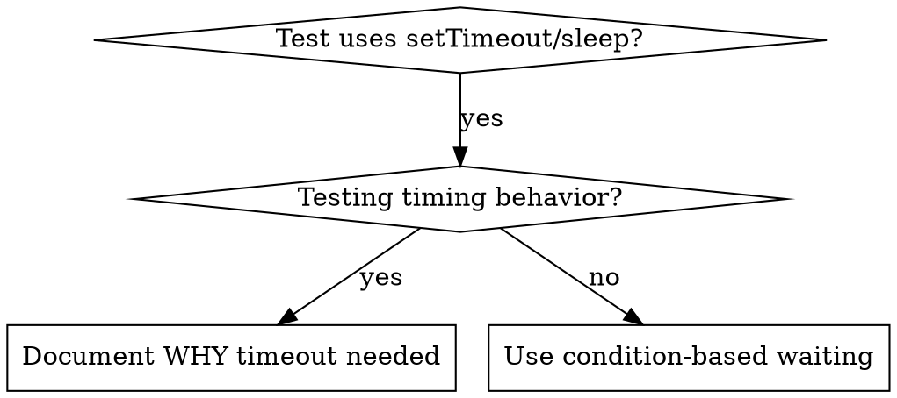

# Condition-Based Waiting

## Overview

Flaky tests often guess at timing with arbitrary delays. This creates race conditions where tests pass on fast machines but fail under load or in CI.

**Core principle:** Wait for the actual condition you care about, not a guess about how long it takes.

## When to Use



**Use when:**
- Tests have arbitrary delays (`setTimeout`, `sleep`, `time.sleep()`)
- Tests are flaky (pass sometimes, fail under load)
- Tests timeout when run in parallel
- Waiting for async operations to complete

**Don't use when:**
- Testing actual timing behavior (debounce, throttle intervals)
- Always document WHY if using arbitrary timeout

## Core Pattern

```dart
// ❌ BEFORE: Guessing at timing
await Future<void>.delayed(const Duration(milliseconds: 50));
final result = getResult();
expect(result, isNotNull);

// ✅ AFTER: Waiting for condition
await waitFor(() => getResult());
final result = getResult();
expect(result, isNotNull);
```

## Quick Patterns

| Scenario | Pattern |
|----------|---------|
| Wait for event | `await waitFor(() => firstEventOfType(events, 'DONE'))` |
| Wait for state | `await waitFor(() => bloc.state.isReady ? true : null)` |
| Wait for count | `await waitFor(() => items.length >= 5 ? true : null)` |
| Wait for file | `await waitFor(() => File(path).existsSync() ? true : null)` |
| Complex condition | `await waitFor(() => obj.isReady && obj.value > 10 ? true : null)` |

## Implementation

Generic polling helper:
```dart
Future<T> waitFor<T>(
  FutureOr<T?> Function() condition, {
  String description = 'condition',
  Duration timeout = const Duration(seconds: 5),
}) async {
  final deadline = DateTime.now().add(timeout);
  while (true) {
    final result = await condition();
    if (result != null) return result;
    if (DateTime.now().isAfter(deadline)) {
      throw TimeoutException('Timeout waiting for $description after ${timeout.inSeconds}s');
    }
    await Future<void>.delayed(const Duration(milliseconds: 10)); // poll every 10ms
  }
}
```

See `condition-based-waiting-example.dart` in this directory for a complete implementation with domain-specific helpers (`waitForEvent`, `waitForEventCount`, `waitForEventMatch`) from an actual debugging session.

## Common Mistakes

**❌ Polling too fast:** `setTimeout(check, 1)` - wastes CPU
**✅ Fix:** Poll every 10ms

**❌ No timeout:** Loop forever if condition never met
**✅ Fix:** Always include timeout with clear error

**❌ Stale data:** Cache state before loop
**✅ Fix:** Call getter inside loop for fresh data

## When Arbitrary Timeout IS Correct

```dart
// Tool ticks every 100ms - need 2 ticks to verify partial output
await waitForEvent(manager, 'toolStarted'); // First: wait for condition
await Future<void>.delayed(const Duration(milliseconds: 200)); // Then: wait for timed behavior
// 200ms = 2 ticks at 100ms intervals — documented and justified
```

**Requirements:**
1. First wait for triggering condition
2. Based on known timing (not guessing)
3. Comment explaining WHY

## Real-World Impact

From debugging session (2025-10-03):
- Fixed 15 flaky tests across 3 files
- Pass rate: 60% → 100%
- Execution time: 40% faster
- No more race conditions
