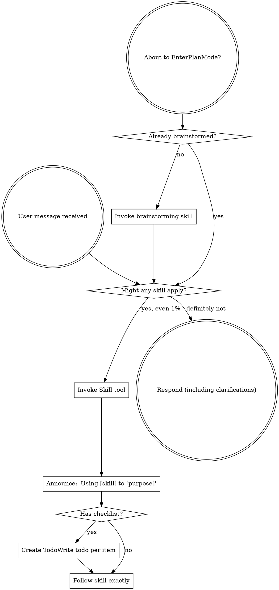

<SUBAGENT-STOP>
If you were dispatched as a subagent to execute a specific task, skip this skill.
</SUBAGENT-STOP>

<EXTREMELY-IMPORTANT>
If you think there is even a 1% chance a skill might apply to what you are doing, you ABSOLUTELY MUST invoke the skill.

IF A SKILL APPLIES TO YOUR TASK, YOU DO NOT HAVE A CHOICE. YOU MUST USE IT.

This is not negotiable. This is not optional. You cannot rationalize your way out of this.
</EXTREMELY-IMPORTANT>

## Instruction Priority

Superpowers Flutter skills override default system prompt behavior, but **user instructions always take precedence**:

1. **User's explicit instructions** (CLAUDE.md, GEMINI.md, AGENTS.md, direct requests) — highest priority
2. **Superpowers skills** — override default system behavior where they conflict
3. **Default system prompt** — lowest priority

If CLAUDE.md, GEMINI.md, or AGENTS.md says "don't use TDD" and a skill says "always use TDD," follow the user's instructions. The user is in control.

## How to Access Skills

**In Claude Code:** Use the `Skill` tool. When you invoke a skill, its content is loaded and presented to you—follow it directly. Never use the Read tool on skill files.

**In Copilot CLI:** Use the `skill` tool. Skills are auto-discovered from installed plugins. The `skill` tool works the same as Claude Code's `Skill` tool.

**In Gemini CLI:** Skills activate via the `activate_skill` tool. Gemini loads skill metadata at session start and activates the full content on demand.

**In other environments:** Check your platform's documentation for how skills are loaded.

## Platform Adaptation

Skills use Claude Code tool names. Non-CC platforms: see `references/copilot-tools.md` (Copilot CLI), `references/codex-tools.md` (Codex) for tool equivalents. Gemini CLI users get the tool mapping loaded automatically via GEMINI.md.

# Using Skills

## The Rule

**Invoke relevant or requested skills BEFORE any response or action.** Even a 1% chance a skill might apply means that you should invoke the skill to check. If an invoked skill turns out to be wrong for the situation, you don't need to use it.

## Red Flags

These thoughts mean STOP—you're rationalizing:

| Thought | Reality |
|---------|---------|
| "This is just a simple question" | Questions are tasks. Check for skills. |
| "I need more context first" | Skill check comes BEFORE clarifying questions. |
| "Let me explore the codebase first" | Skills tell you HOW to explore. Check first. |
| "I can check git/files quickly" | Files lack conversation context. Check for skills. |
| "Let me gather information first" | Skills tell you HOW to gather information. |
| "This doesn't need a formal skill" | If a skill exists, use it. |
| "I remember this skill" | Skills evolve. Read current version. |
| "This doesn't count as a task" | Action = task. Check for skills. |
| "The skill is overkill" | Simple things become complex. Use it. |
| "I'll just do this one thing first" | Check BEFORE doing anything. |
| "This feels productive" | Undisciplined action wastes time. Skills prevent this. |
| "I know what that means" | Knowing the concept ≠ using the skill. Invoke it. |

## Skill Priority

When multiple skills could apply, use this order:

1. **Process skills first** (brainstorming, debugging) - these determine HOW to approach the task
2. **Implementation skills second** (frontend-design, mcp-builder) - these guide execution

"Let's build X" → brainstorming first, then implementation skills.
"Fix this bug" → debugging first, then domain-specific skills.

## Skill Types

**Rigid** (TDD, debugging): Follow exactly. Don't adapt away discipline.

**Flexible** (patterns): Adapt principles to context.

The skill itself tells you which.

## User Instructions

Instructions say WHAT, not HOW. "Add X" or "Fix Y" doesn't mean skip workflows.

## Skills Catalog

All available skills — invoke with the `Skill` tool using the `name` value.

### Process & Workflow

| Name | When to Use |
|------|-------------|
| `superpowers-flutter:brainstorming` | When starting any creative work — new features, components, or behavior changes (**REQUIRED**) |
| `superpowers-flutter:test-driven-development` | When implementing any feature or bugfix — before writing implementation code (**REQUIRED**) |
| `superpowers-flutter:systematic-debugging` | When diagnosing a bug or unexpected behavior |
| `superpowers-flutter:writing-plans` | When planning a multi-step implementation |
| `superpowers-flutter:executing-plans` | When executing an existing plan |
| `superpowers-flutter:dispatching-parallel-agents` | When parallelizing independent work across subagents |
| `superpowers-flutter:subagent-driven-development` | When using subagents to implement and review code |
| `superpowers-flutter:verification-before-completion` | When finishing a task — before marking it done |
| `superpowers-flutter:finishing-a-development-branch` | When wrapping up a feature branch for PR |
| `superpowers-flutter:using-git-worktrees` | When needing isolated git worktrees for parallel work |
| `superpowers-flutter:compound` | When a non-trivial problem has just been solved — capture the solution |

### Session Continuity

| Name | When to Use |
|------|-------------|
| `superpowers-flutter:handoff` | When capturing session state before switching context, ending a session, or manually preserving progress |
| `superpowers-flutter:handoff-resume` | When starting a new session and wanting to continue from a previous handoff |
| `superpowers-flutter:handoff-list` | When viewing available handoff documents |

### Flutter & Dart

| Name | When to Use |
|------|-------------|
| `superpowers-flutter:dart` | When writing, reviewing, or debugging any Dart code — Effective Dart, Dart 3 features (records, patterns, sealed classes), error handling, async idioms |
| `superpowers-flutter:flutter-clean-architecture` | When creating or restructuring a feature, adding a repository, use case, data source, or wiring dependency injection (**REQUIRED** for new features) |
| `superpowers-flutter:bloc` | When adding or changing state management — any Bloc, Cubit, event, or state class |
| `superpowers-flutter:flutter-widget-rules` | When writing or reviewing any widget — build size, extraction, const, keys, BuildContext safety |
| `superpowers-flutter:flutter-analyze` | Before committing or requesting review, when analyzer warnings appear, when setting up lints |
| `superpowers-flutter:go-router` | When working on navigation and `go_router` is in pubspec.yaml |
| `superpowers-flutter:auto-route` | When working on navigation and `auto_route` is in pubspec.yaml |
| `superpowers-flutter:fpdart` | When writing domain or data code and `fpdart` is in pubspec.yaml |
| `superpowers-flutter:flutter-docs` | When any Flutter or Dart framework/API question comes up — topic map to official docs |
| `superpowers-flutter:flutter-upgrade` | When bumping the Flutter/Dart SDK or a major package version |
| `superpowers-flutter:dart-commit-message` | When committing changes in a Flutter or Dart project |

### Code Review & Quality

| Name | When to Use |
|------|-------------|
| `superpowers-flutter:requesting-code-review` | When submitting code for review |
| `superpowers-flutter:receiving-code-review` | When processing incoming code review feedback |

### Meta

| Name | When to Use |
|------|-------------|
| `superpowers-flutter:writing-skills` | When authoring a new skill or improving an existing one |
| `superpowers-flutter:compound` | When capturing a non-trivial solution for compound knowledge |
| `superpowers-flutter:compound-refresh` | When docs/solutions/ learnings may be stale — after refactors, migrations, or dependency upgrades |
